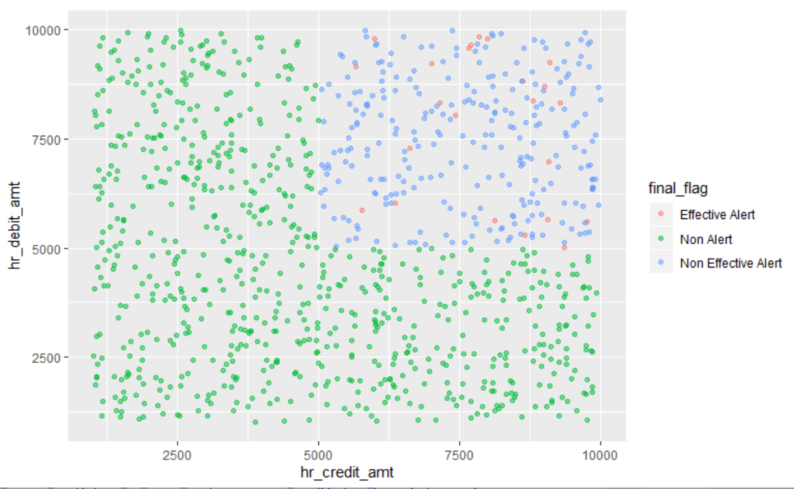
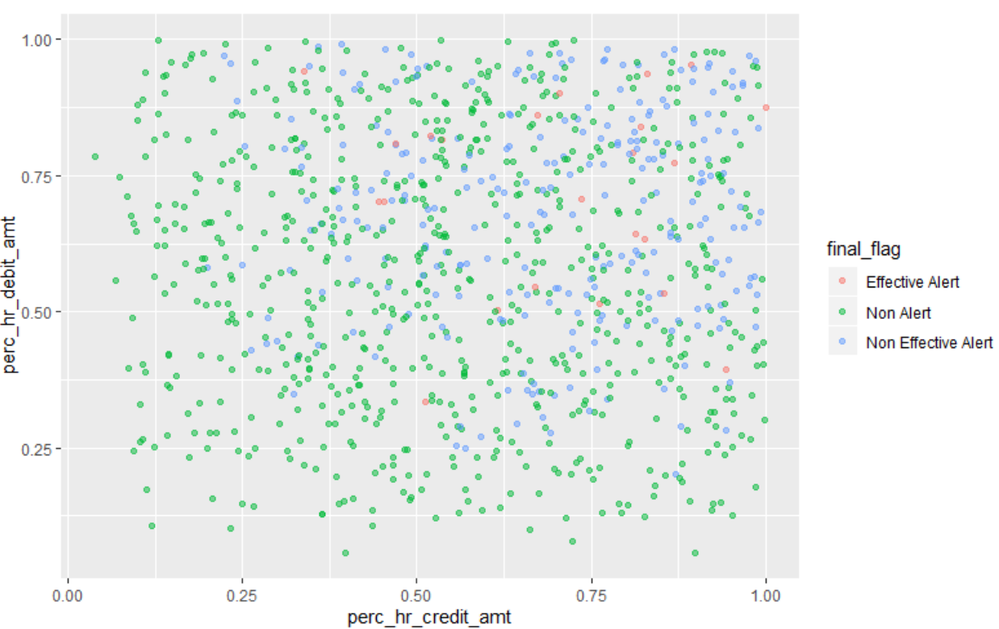

# Introduction

Supervised ML models have been successfully used to detect fraud in the financial industry for several years. Using similar ML models to detect money laundering almost seems inevitable but is still not widely used in industry. The application of supervised models in AML may be subject to some limitations compared to fraud as described below.

1)  Unlike AML, an incidence of fraud can be confirmed with 100% certainty as there is often a financial loss or evidence of an account take over when a customer calls in to report fraud. This means the labels are accurate. In AML however, it is very rare that a case is truly confirmed as money Laundering. Given law enforcement never confirms that reported cases were determine to be Money laundering, the labels in AML are not 100% certain. Given the lower quality of labels, the performance of supervised models in AML may always fall shy of those in Fraud

2)  In fraud, the kind of fraud that occurs in Credit Card, Debit Card or check deposits are distinct. Given each product is associated with a different kind of fraud, it is easier to build models targeting specific types of fraud. In AML however such obvious distinctions do not exist. There is a dependency on a bank to create an appropriate taxonomy for different kinds of AML cases and on AML analysts to label cases accordingly. Given this is not standard practice today, building target supervised models in the AML domain may be harder

3)  As explained in [this](https://a16z.com/2020/08/12/taming-the-tail-adventures-in-improving-ai-economics/) article by Andreesen Horowitz, AML is characterized by ‘local long tailed’ distributions of data.

-   If different typologies of suspicious behavior are very different and they vary from institution to institution, the cost of building an accurate model will be much higher per customer.

-   Diseconomies of scale: For long tailed problems, you need exponentially more data to get a linear improvement in results.

These are real problems that need to be addressed in partnership with financial institutions.

A fourth problem that is cited as one that stymies the use of supervised models in AML is the 'Lack of Below The Line data'. I describe this problem below and argue why it is an incorrect description of the problem and how framing of the problem in this manner leads to inappropriate solutions.

# BTL Data

Below the line data is the region of alerts below the current thresholds. Consider a scenario:

> If High Risk Credit Amount \>= 5000 and High Risk Debit Amount \>= 5000 : Trigger an Alert

The below the line region is represented by the green dots in the figure below. They are 'non alerts' that would have been alerts had the thresholds been lower. All the labeled data that is available for training a model is ATL data (the red and blue). Clearly if we train the model just on the ATL data, the model will not be applicable to the BTL data.

However, the supervised model is not being trained with just the two parameters used in the scenario above, in fact the supervised model can use engineered features that are derived from the two features above or any number of additional attributes. For instance, one feature can be the Perc_Credit_HR_Amt which captures what fraction of the Total Credit Amount is High risk and the Perc_Debit_HR_amt which captures what fraction of the Total Debit Amount is High Risk. The same data in this transformed feature space is shown below.

In this transformed feature space, there is no clear line demarcating ATL from BTL. Given we are training the model in this transformed feature space, the argument that the model can be used only in a distinct well defined portion of the feature space or 'ATL' does not hold.

The solution proposed to address this problem is to gather more BTL data as part of the BTL testing process.

BTL testing is the process of sampling the population of non-alerts below the existing thresholds and reviewing them manually to evaluate whether the current thresholds are appropriate, whether they can be retained or have to be changed

However using BTL sampling as a vehicle to gather labelled data for model training has several issues.

1)  BTL samples sizes are calculated using the hyper-geometric sampling calculator. The hyper-geometric sample size is calculated such that finding at least one effective alert in the sample indicates that the effectiveness of the population is greater than the acceptable effectiveness assumed to calculate the sample size. This means that banks typically do not review the entire sample but stop as soon as they find the first effective alert in the sample.

2)  They are just samples of the BTL region when the entire population of the ATL region is available. Given the large imbalance between ATL and BTL data available to the model, any model trained on this data will be biased towards the ATL data. this is further compounded by the fact that the incidence of effective alerts is likely to be much lower in the BTL population with the result that the model is far less likely to accurately detect suspicious activity BTL

3)  The samples are random and hence are likely to be redundant. If the BTL samples are from a region in the transformed feature space where sufficient data is already available, this additional BTL data will not make any difference to the model.

# Building Supervised Models for AML

Although I have argued that the lack of BTL data is an incorrect framing of the problem, the lack of representative data of the entire population is still a problem. To make supervised ML viable in the AML domain, there are potentially two solutions to this problem, the **first** will be a two-pronged strategy utilizing the following

a)  Incorporate uncertainty intervals into predictions:

The model should make explicit the confidence it has in a prediction. This will ensure that the model is used appropriately only in instances where it has a higher degree of confidence. In regions where the model has a lower degree of confidence, simpler rules can be utilized. This will mitigate any model risk arising from using the model inappropriately.

b)  Gather more data using Active Learning:

While a) will allow Financial institutions to start using ML solutions today, this will allow the FI to efficiently collect data that can enhance the performance of the model over time.

Active learning is a more deliberate and efficient way to collect data rather than randomly sampling below the line. it ensures the data gathered is not redundant and ensures an improvement in the model's confidence and performance in every iteration.

The **second** solution will leverage semi-supervised learning in some form.

Semi Supervised Learning, typically involves using a small amount of labelled data to train a teacher model model and using this model to generate predictions on unlabeled data. Now you pre-train a student model on this larger data set and fine tune on the original labelled data. the concept of fine-tuning is applicable mostly to neural networks, so this needs to be translated to classical ML models.

A successful [application](https://www.oreilly.com/library/view/oreilly-artificial-intelligence/9781492050667/video326652.html) of semi supervised ML was presented by Visa Research at the 2019 O'Reilly AI Conference to detect merchant breaches. Their approach is to train a CNN on very limited merchant data breaches and use it to label the much larger unlabeled data set. A second model is then trained on the labelled data and used to detect these breaches. The solution led to detection of breaches 48 days earlier than the incumbent approach and fraud reduction to the tune of \$ 7M.

As per Andreesen Horrowitz, companies addressing long tailed problems have also found the following approaches useful.

• If there is consistency across customers, serve customers with a global model built on pooled data with customization for large customers. This has worked really well in fraud detection but it is unclear whether it will work in AML given the problem is ‘local long tail’

• Meta Models, Transfer Learning and Trunk Models: These are probably relevant only when using deep learning that is uncommon in AML

• Building data sets in the long tail covering edge cases necessary for success of ML

# Conclusion

To pave the way for the application of supervised ML to solve problems in AML, Financial Institutions need to be able to get value out of ML with the data available today while mitigating any model risk from doing so. The directive to collect large amounts of labelled BTL data before they effectively start using ML will not be well received by most FIs.

ML and Data science initiatives succeed only through an iterative process, vendors should build products that allows banks to builds useful ML models with data available today while creating a framework that will allow them to iterate quickly by collecting more labelled data and refining their models.

Given the data challenges in AML, financial institutions might also be reluctant to invest heavily upfront in ML knowing that really good models will be available only after several iterations. To help spread costs across lines of business and to see an earlier return on investment, financial institutions will increasingly look to address adjacent problems such as client insights, marketing or even fraud using the same ML tooling. Machine Learning vendors in the AML space will have to find a balance between creating targeted solutions for AML, yet making the underlying methodologies and algorithms generalizable to some of these adjacent problem spaces.
