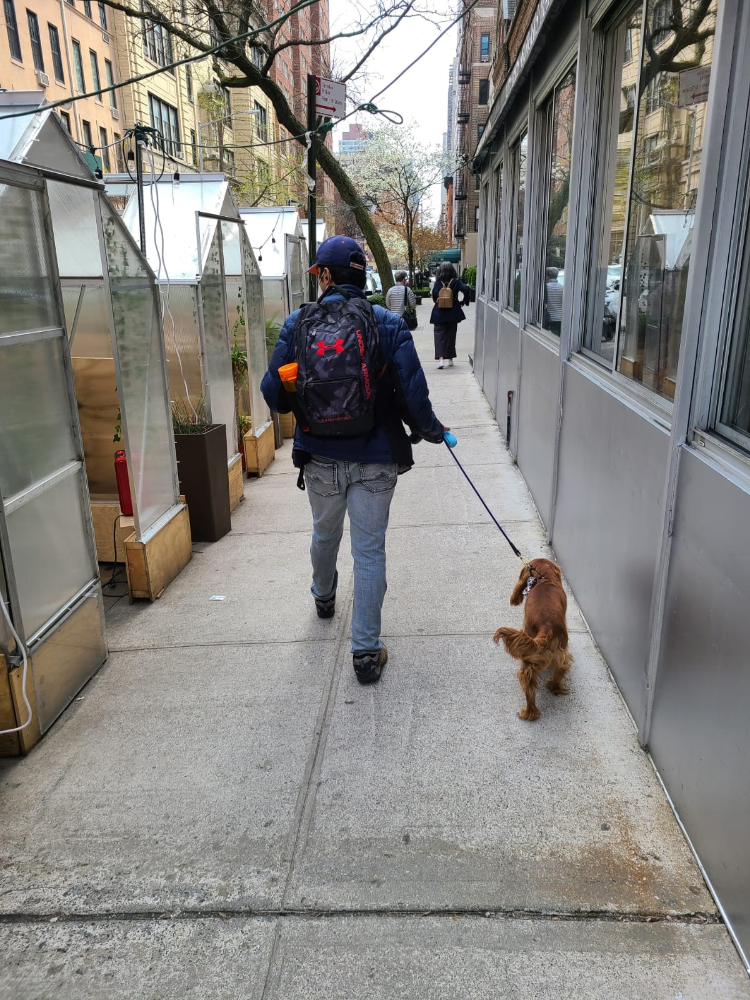
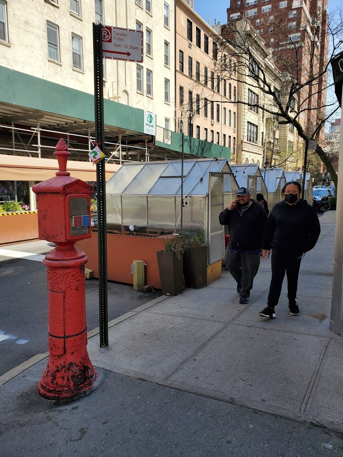

I accompanied my wife to Manhattan yesterday for her scheduled vaccine appointment. This was my first visit to the city in almost 6 months.

NYC is certainly back on its feet and humming along. From what I saw, almost 95% of people were wearing masks and commuters were socially distancing on the subway.

One thing I noticed was how the restaurant industry had responded to servicing customers in the winter in the middle of a pandemic. Outdoor seating was a lifeline for the restaurant industry in the summer, an option that was unfeasible during the harsh winter.

Creative entrepreneurs of course found a way. Enter – heated tents, wooden structures and igloos.

::: figure

Figure 1: Image from Will Feuer, CNBC

:::

As temperatures rise and the pandemic abates, these structures will go down but they are certain to re-appear the next winter. In a way, crisis has forced the industry to respond creatively that will pay off over the long run.

Typically, during the winter, restaurants roll back outdoor dining significantly reducing capacity. Now restaurants will be able to continue offering outdoor seating during the winters, a measure that should help boost revenue.

The economist Paul Romer said a crisis is a terrible thing to waste. The restaurant industry certainly has taken a beating in this crisis, but they certainly haven’t wasted it.
