I will progressively summarize talks I find illuminating from the [Stanford MLSys](https://mlsys.stanford.edu/) Seminar Series here.

# 1) Deep Learning at Scale with Horovod \| Travis Addair

Talk Link: https://www.youtube.com/watch?v=DB7oOZ5hyrE

-   There are two types of distributed deep learning:

1)  Model Parallelism : This is used when a model is too large to fit into a single GPU. Here the model is distributed across multiple machines.<br>
2)  Data Parallelism: This is used when the data is too large to fit into a single GPU. Here the data is distributed across multiple machines, but the model is instantiated in each machine.

Horovod is a system for data parallelism.

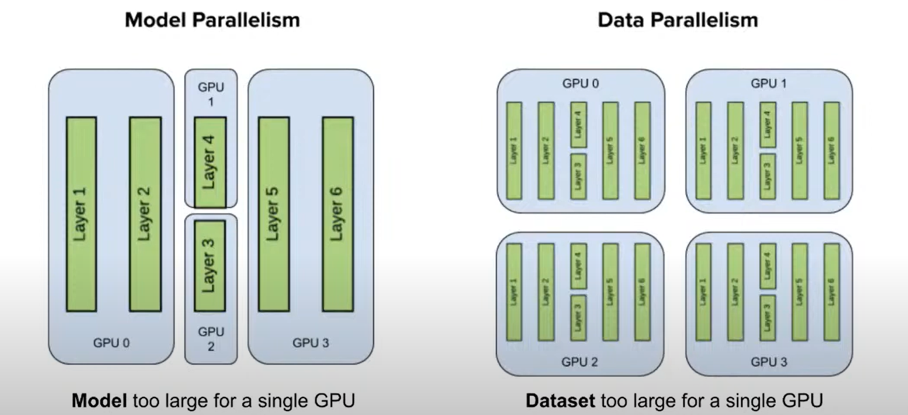

-   The pre-Horovod approach to data parallelism pioneered by Google used parameter servers.


In this approach,weights are updated synchronously by a parameter server using gradients shared by workers. The weights are then returned to the workers for the next round of gradient descent.

**Pros** <br>

-   Asynchronous SGD is possible <br>
-   Fault tolerant

**Cons** <br> - Usability: - There is a tight coupling between model and parameters. - A system admin has to determine and allocate resources for the server and client.

-   Scalability:
    -   Parameter server is an intermediary through which messages have to be relayed to clients leading to increased message passing.
    -   Increased bandwidth utilization.
-   Convergence challenges with asynchronous SGD
    -   When SGD is done asynchronously, there is often the stale gradient problem where a straggler worker reports a gradient several iterations late.
-   Horovod uses a technique called Ring Allreduce developed by Baidu. This algorithm has been proven to be the bandwidth optimal way of doing gradient aggregation.


### Horovod

Data parallel framework for distributed deep learning.

-   Framework agnostic
    -   Supports TF, MXNet, TF and Keras
-   High Performance features
    -   NVIDIA's NCCL allows direct GPU access which obviates the need to move data between GPU and CPU or sending it across the network
    -   tensor fusion: Can fetch multiple gradients using a single network call
-   Easy to use and install.

### API and Architecture

#### GPU Pinning

-   Uses a driver application like MPI Run
-   Each horovod worker affinitize themselves to a specific GPU
-   No of workers = No of GPUs to prevent any contention in terms of resource consumption

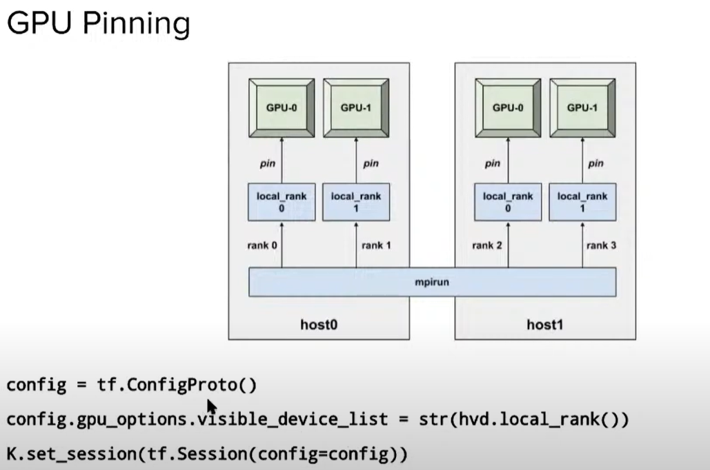 \#### State Synchronization - All model replicas on all workers should have same parameters at any given point in time. - API call available to synchronize all workers at start of training

`callbacks = [hvd.callbacks.BroadcastGlobalVariablesCallback(0)]`

#### Learning Rate Scaling

-   Data parallel means bigger batch size
    -   Total batch size = local batch size x N
-   Learning rate should also be scaled up
    -   $$ LR_N = LR_1 \times N $$
-   APIs available for smooth learning rate warm up and decay
    -   `opt = keras.optimizers.Adadelta(lr=0.01 * hvd.size())`
    -   `opt = hvd.DistributedoOptimizer(opt)`

Distributed training can be accomplished with some minor augmentations to existing Keras script

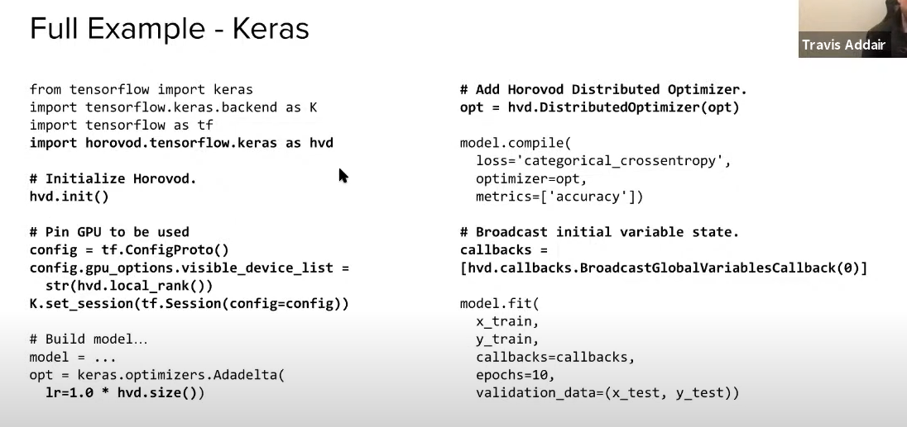

#### Horovod Architecture

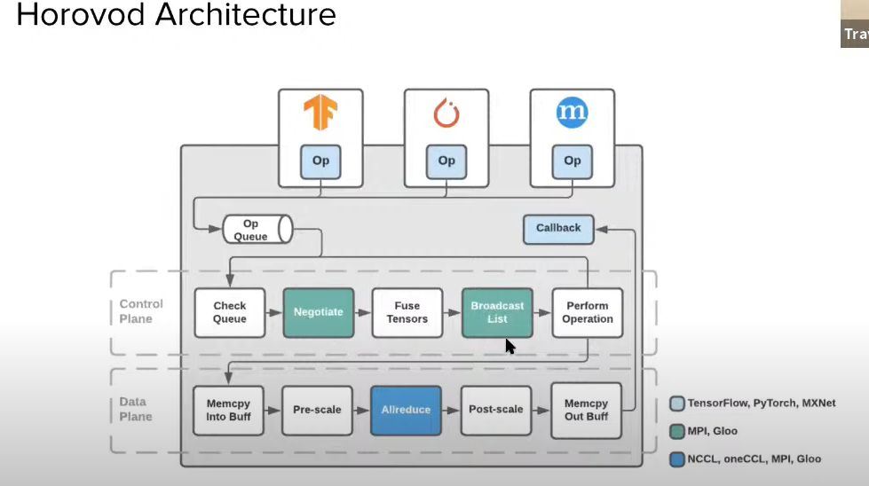

-   Custom operations are implemented for each supported framework
-   When you install Horovod, C++ code linked against native libraries are compiled
-   When a framework gets an operation like 'allreduce' , it is submitted to a queue internally within Horovod
-   Control plane checks the queue and performs a negotiation step to figure out which workers have which tensors ready, given frameworks like TF are asynchronous
-   Tensors are then fused together into a single buffer
-   An arbitrarily chosen worker broadcasts lists of operations to other workers and submits to Data plane
-   A simple[memcopy](https://www.tutorialspoint.com/c_standard_library/c_function_memcpy.htm) is done to the fusion buffer.
-   It is scaled to prevent underflow and overflow
-   All-reduce algorithm is then run.
-   Optimizations have been added to the Negotiate,Broadcast and allreduce steps

### Horovod on Spark

```         
## Warning: package 'knitr' was built under R version 4.0.5
```

::: figure


<p class="caption">

Figure 1: A Typical Deep Learning pipeline

</p>
:::

-   End to End Training in Spark was one of the first integrations
-   Horovod available on Spark for doing distributed deep learning : https://horovod.readthedocs.io/en/stable/api.html#module-horovod.spark
-   Horovod spark estimators allow you to define define a spark ml pipeline where model fitting using keras is one of several pre-processing/post-processing steps

```         
from tensorflow import keras
import tensorflow as tf
import horovod.spark.keras as hvd


model = keras.models.Sequential()
        .add(keras.layers.Dense(8,input_dim=2))
        .add(keras.layers.Activation('tanh'))
        .add(keras.layers.Dense(1))
        .add(keras.layers.Activation('sigmoid'))
 
optimizer = keras.optimizers.SGD(lr=0.1)
loss = 'binary_crossentropy'

keras_estimator = hvd.KerasEstimator(model,optimizer,loss)

pipeline = Pipeline(stages=[...,keras_estimator,...])
trained_pipeline = pipeline.fit(train_df)
pred_df = trained_pipeline.transform(test_df)
```

::: figure


<p class="caption">

Figure 2: Deep Learning in Spark 3.0 Cluster

</p>
:::

-   Allows you to transition between using CPUs for feature engineering and GPUs for training.
-   Materializes spark data frame into a parquet file on HDFS which is then used for training.
-   RDD(Resilient Distributed Dataset) available in Spark is not used as deep learning requires shuffling of data.
-   Spark and RDD was designed to solve data problems whereas the problem here is one of compute

### Deep Learning in Spark with Horovod and Petastorm

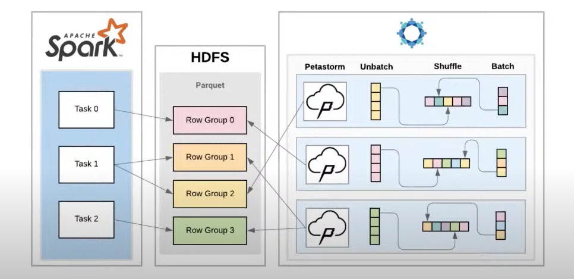

-   [Petastorm](https://github.com/uber/petastorm) reads row groups from HDFS.
-   Petastorm worker then unbatches row group into elements , inserts them into a buffer which then gets the shuffled.
-   Downstream worker can then sample from this to get batches.
-   Petastorm optimizes a lot of the data reading process including caching and buffering

### Horovod on Ray

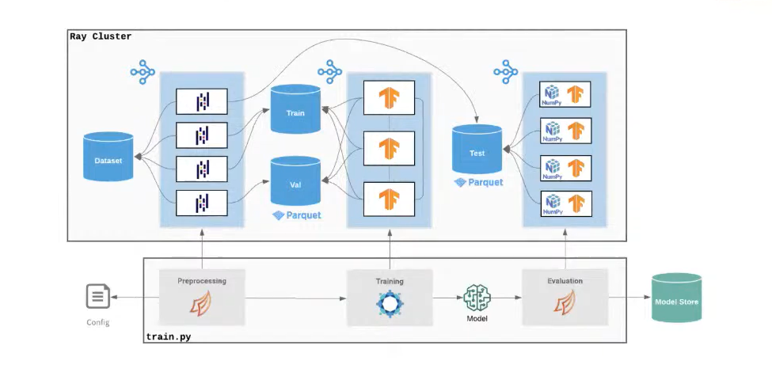

-   More similar to doing deep learning on a desktop. Typically everything has to be done in Spark with heterogeneous infrastructure (Spark/Parquet/Horovod)that is challenging for any data scientist.
-   Ray brings all this heterogeneous compute into a single infrastructure layer which is abstracted from the user
-   Pre-processing can be done in Dask which exposes the same APIs as Pandas
-   Training can then be done using Horovod with Ray in a distributed manner.
-   Horovod has also been integrated with Ray tune for hyperparameter tuning.
-   Horovod on Ray has a stateful API as Ray actors can be stateful. It has a caching layer which can store things in between invocations.
-   This allows you to multiple training runs on a remote worker without communicating with the server.

### Elastic Horovod

-   In a cloud setting with pre-emptible instances, a worker might come online late or might fail, so you need to switch between workers.
    -   Fault Tolerance: Continue training if a single worker fails
    -   Cost reduction: Using [pre-emptible](https://cloud.google.com/compute/docs/instances/preemptible) instances is cheaper vs dedicated instances
    -   Cluster Utilization on prem: Scale workers up and down based on demand.


-   Driver sits on top of Ray head node
-   If you get advance notice that a worker is going to be removed, you can remove it from the Horovod job at a point when all the workers are in sync. If this is not available , you have to roll back the workers to a previous state using an expensive commit operation
-   The workers synchronize , train and check for host operations. Since host removal event was sent to the driver, workers are notified that a worker is going to be removed.
-   This prompts all workers to stop and wait until the worker in question is removed by cluster orchestrator before training resumes.

### Future of Horovod

#### Hybrid Parallelism

-   Large models use embeddings tables that are really big . Each embedding table is hosted on a different GPU
-   An **All to All** operation is then used to combine these different embeddings in a data parallel fashion. Each worker operates on a subset of the data in the second stage.
-   Integrating Deep Learning accelerators like SambaNova, Cerebras, Graphcore

#### Distributed Hyper parameter search


-   Let every number be a GPU and every color be a trial
-   After every 10 epochs, remove a low performing trial and allocate the GPU to a higher performing trial.
-   Do this successively and finally deploy all resources on highest performing trials

#### Unified End to End Infrastructure

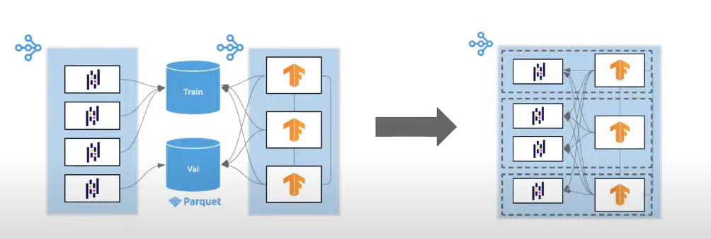

-   Currently the feature engineering and training steps are distinct with data being dumped to a disk in between
-   These steps are slowly converging.
-   In the future, training and pre-processing nodes will be co-located. Data will be accessible in both steps through a shared memory rather than dumping to disk.
-   This will speed up the end to end workflow.

### Advice when using Horovod

-   Horovod caveat: Manage learning rates carefully in a distributed setting.
-   Partitioning and shuffling is also very important. If shuffling is not done properly, there can be correlation between data for a worker.
-   Horovod can be slower than using a single GPU, it might be because of the I/O rather than issues with your model forward/backward pass.
-   Use Horovod only when single GPU has full utilization.

# 2) Reinforcement Learning for Hardware Design \| Anna Goldie

Talk Link: https://www.youtube.com/watch?v=Y4fcSwsNqoE

## Chip Floor Planning Problem

-   Task of designing the physical layout of a computer chip
-   Solution is a form of graph resource optimization
-   Place the chip components such as macros(memory components) and standard cells(logic gates such as NAND and NOR) on a canvas to minimize the latency of computation, power consumption etc. while adhering to constraints such as congestion, cell utilization, heat profile etc.
-   No of states: $$ 10^{9000} $$
-   Prior approaches include partitioning based methods(e.g. MinCut), stochastic methods (e.g. simulated annealing) and analytic solvers (e.g. RePlAce)

## Chip Floor Planning with RL

-   Train an agent to place the components on the canvas. Reward signal is used to update the parameters of the RL Policy
-   Algorithm used: PPO

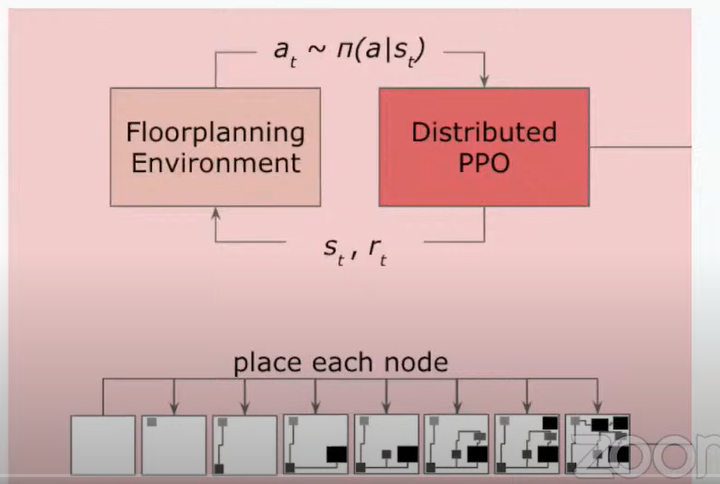

-   **State**: Graph embedding of a chip [netlist](https://en.wikipedia.org/wiki/Netlist) or the graph, embedding of the node being placed next, and the canvas on which the graph is placed.
-   **Action**: Where to place the node on the canvas
-   **Reward**: After placing every node, take the Negative Weighted average of total wire length, density and congestion

### Objective Function

$$ J(\theta,G) = \frac{1}{K} \sum\limits_{g \sim G} E_{g,p \sim \pi_{\theta}} [R_{p,g}]  $$

where:

$G$ : Set of training graphs <br> $K$ : Size of training set <br> $\pi*{*\theta}$ : RL policy parameterized by $\theta$ $R{p,g}$: Reward corresponding to placement of node p on graph g

$$ R_{p,g} = -Wirelength(p,g) - \lambda Congestion(p,g) - \gamma Denisty(p,g) $$

### Results

-   Smoother , rounder palcements

-   Reduces total wirelength by 2.9% and takes only 24 hrs vs 6-8 weeks for humans

-   Using a pre-trained policy, no of iterations required to place a chip on a canvas was reduced from 10,000's to 100's

-   Supervised learning was used to learn generalizable representations of the problem

-   Value network was doing poorly in predicting the quality of placements when trained on placements generated by a single policy. Problem was decomposed by training models capable of accurately predicting reward from off-policy data.

    -   This model was trained by extracting samples from various stages of the RL training process. In the earlier stages, placements are poor and later stages, placements are really good. Wirelengths and costs were also estimated.

-   This model was then used as an encoder for the RL Agent

## Reward Model Architecture

Edge property focused Graph CNNs were used.

-   Node features include x and y co-ordinates, width and heights, type of macros etc.
-   Two fully connected layers used, one the predicts wire length and another that predicts congestion.
-   Key metrics like wire_length are edge properties,so edge focused CNN makes more sense

### Edge Based Convolutions

1)  Get node embeddings by passing node properties through a fully connected layer

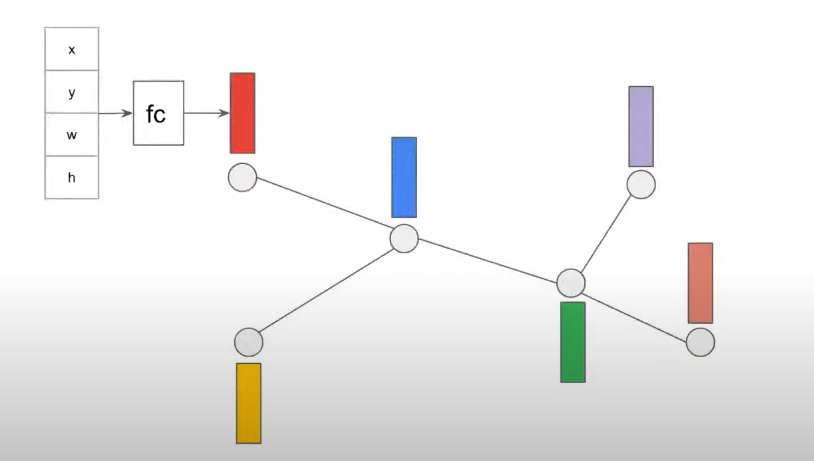

2)  Get edge features by concatenating the embeddings of the nodes of the edge.


3)  Get edge embeddings by passing the edge feature through a fully connected layer

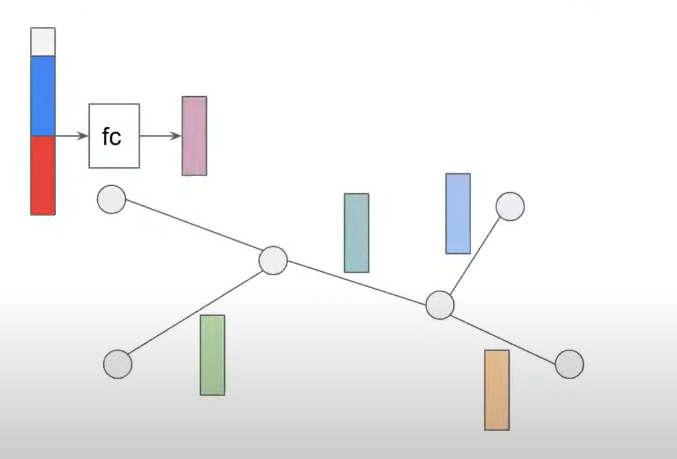

4)  Propagate: Get new representation of the node by taking the mean of the edge embeddings the node participates in

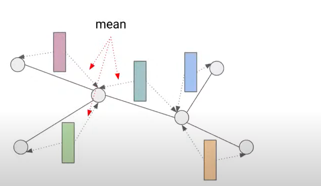

5)  Rinse and repeat Steps 2 - 4.7 iterations give good results. Each node is influenced by its 7-hop neighborhood

6)  Take a mean over all edges in the graph to get a representation of the entire graph.

## Policy/Value Model Architecture

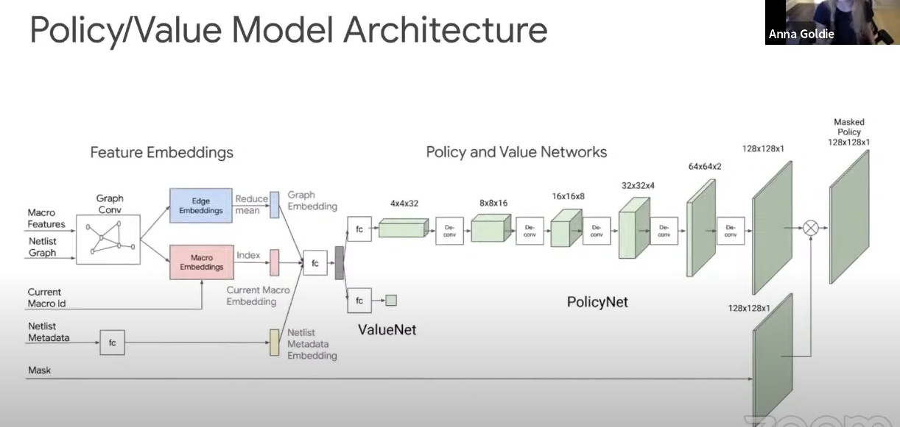 - Embeddings are passed into the policy network that predicts the probability distribution for placement of nodes on the canvas - Valuenet predicts quality of placements so far. - A "Mask" is used to prevent invalid placements

## Other Points

-   No incremental rewards were used, only a final reward at the end.
-   Reduced chip placement times from weeks to 24 hours, allowing faster experimentation. SIll takes 72 hours to fabricate and test the chip and retrieve relevant metrics.

Paper: https://arxiv.org/pdf/2004.10746.pdf

# 3) On Hetrogeneity in Federated Settings \| Virginia Smith

## Workflow and SetUp

Goal is to train an ML model across multiple remote devices.

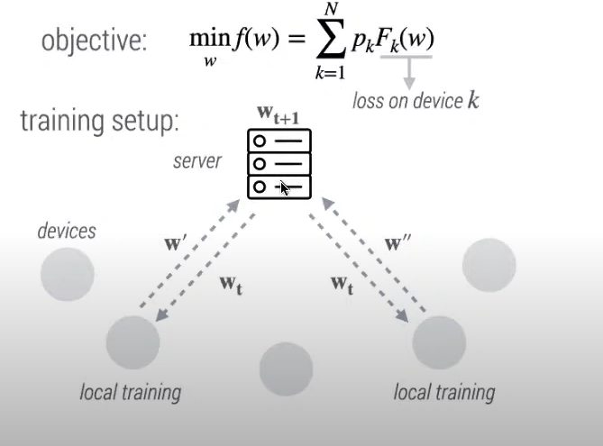

-   Objective is to minimize sum of losses across k devices
-   At every training iteration, the central server sends current version of the model to a subset of the devices, the devices perform local training and return model updates to central server.
-   Challenges
    -   Expensive communications
        -   massive, slow networks across thousands of devices e.g. cell phones
    -   Privacy concerns - user privacy constraints
    -   statistical heterogeneity - unbalanced, non -IID data
    -   systems heterogeneity - variable hardware, connectivity etc

## Heterogeneity Considerations

-   Impact of heterogeneity on federated optimization methods
-   Model might perform well on subset of devices and poorly on other devices. How to equalize performance across diverse networks ?
-   Personalizing models for specific devices

## Federated Averaging


Train models on a device, share trained model with central server which averages the models ,sends it back to devices for additional local training.

-   Federated averaging can diverge in heterogeneous settings.
-   As the amount of local work increases, performance can deteriorate

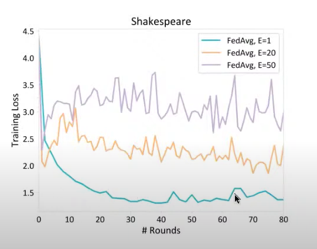

-   X axis: No of communication rounds
-   In the presence of statistical heterogeneity, As the amount of local work increases, performance can deteriorate
-   Behavior can be even worse in the presence of systems heterogeneity e.g. some devices are stragglers and cannot complete training in time. Such stragglers may have to be dropped from the training update which exacerbates convergence issues

## FedProx

-   Algorithm for heterogeneous optimization.
-   Modifies the local sub problem for device k.

$$ \min\limits_{w_k} F_k(w_k) + \frac{\mu}{2} \Vert w_k - w^t \Vert^2 $$ The first term is a loss function on the local weights on device k.

The second term is the **proximal term**. It limits the impact of local heterogeneous updates by ensuring that local update is not too different from global weights.

This approach also incorporates partial work completed by stragglers.

This approach converges despite *non-IID data, local updating and partial participation*

**Key result**: Fed prox with the proximal term leads to a 22% test accuracy improvement on average.

## Fairness

-   Most approaches use some form of empirical risk minimization approach that attempts to reduce the weighted loss across all devices, this does not ensure uniformly good performance across devices.
-   Solution inspired by fair resource allocation problems e.g. fairly allocating bandwidth: $\alpha$ fairness

A modified objective (qFFL) is given below

$$qFFL = \min\limits_{w} \frac{1}{q+1} \big( p_1 F_1^{q+1} + p_2 F_2^{q+1} + ... + p_N F_N^{q+1} \big)  $$ If $q \rightarrow 0$, you get the traditional risk minimization objective.

If $q \rightarrow \infty$, you get minimax fairness.

Increasing $q$ reduces variance of accuracy distribution and increases fairness. This approach can cut variance in half while maintaining the overall average accuracy.

## Personalization

-   In the absence of data for a specific, might want to learn from peers.

-   Learning one model across the network means we have non-personalized models.

-   Can you deliver personalized models that learn from peers ?

-   Use the multi task learning framework.

    -   Learn separate model for each device.
    -   Learn relationship that exists between the devices


-   $w_t$ represents models on device $t$

-   $W$ represents a relationship matrix between devices and $\Omega$ represents a task relationship matrix

-   $W$ and $\Omega$ can be learn various possible relationships between devices and tasks ranging from a scenario where all tasks are related across devices to a scenario where 1 device asymmetrically impacts all other devices

-   Not scalable to very deep neural nets

    -   Device metadata can be included in the regularization factor

Benchmark dataset for federated learning: [LEAF](https://leaf.cmu.edu/)

# 4) Bridging Models and Data with Feature Stores \| Willem Pienaar

## Current State

-   Pipelines can be used to process data inside a model as in sklearn or TF
-   Typically there are ETL or ELT pipelines that populate a table
-   Models have to see data twice - during training and inference
    -   These needs to be consistent
-   Typically pipelines are developed by data scientists for model training and then re-developed and maintained by data engineers for model serving

## ML Data Challenges

1.  Building feature pipelines
    -   Feature engineering is time consuming
    -   Requires different technologies for different production requirements (distributed compute , stream processing , low latency transformation)
    -   Reliable computation and backfilling of features requires a large investment
2.  Consistent data access
    -   Redevelopment of pipelines leads to inconsistencies in data
    -   Training-serving skew degrades model performance
    -   Models needs point-in-time correct view of data to avoid label leakage (especially for time series)
3.  Duplication of effort - Siloed development - No means of collaboration or sharing feature pipelines - Lack of governance and standardization
    4.  Ensuring data quality
        -   Is the model receiving right data and still operating correctly ?
        -   Are features fresh ?
        -   Has there been drift in data over time ?

## Solution with Feature Stores

1.  Easy pipeline creation
    -   Write feature definitions in SQL
    -   Register in feature store specifying online or offline computation
    -   Feature is computed and populated at required schedule
2.  Consistent data acess
    -   Common serving API to access data for both training and serving
    -   
3.  Cataloging and Discovery
    -   Can browse through library of features , how many teams use it , documentation etc.
4.  Data quality monitoring
    -   Can produce statistics of data over time
    -   Integrates with packages like [great expectations](https://greatexpectations.io/)
    -   Supports Feature as code, including version control and CI/CD integration.

## Deployment Patterns

1.  Offline feature serving
    -   
    -   Suitable for use cases like Pricing, Risk, Churn prediction where jobs are run periodically or in an ad-hoc fashion
2.  Online feature serving
    -   
    -   Suitable for low latency use cases like recommendations and personalization
3.  Online feature computation
    -   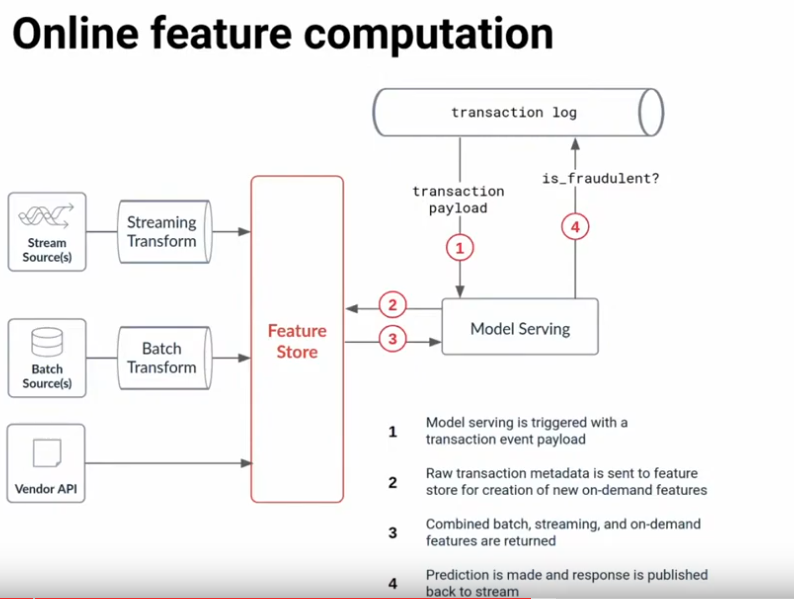
    -   Real time / on demand feature transformations are supported
    -   Model is triggered when a transaction event occurs
    -   The metadata within the transaction is often required to derive features synchronously rather than fetch something that has been pre-computed.
    -   Models serving layer will send trxn metadata to the feature store . Feature store will use pre-computed streaming data , batch data , trxn metadata; call vendor apis; combine these, produce new features and return to mode serving layer.
    -   Call vendor API from feature store, so all this data can be logged.

## Feature Stores in A Modern Data Stack

1.  Greater abstraction meaning we don't need a separate modules for an online store, offline store and data processing
    -   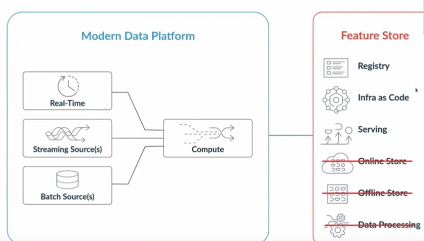
    -   dbt allows you to write ELT type queries
2.  ML engineers create basic model and Data scientists can optimize the model further. This is opposed to the traditional approach of DS developing models locally and ML engineers rewriting and deploying them.

## Other Points

-   Feature stores work better with structured rather than unstructured data
-   The performance of the code you use to write transformations will affect whether you can use a feature in both batch and real time use cases. Writing a transformation in pandas means it could be slower than writing it as a JVM process.

# 5) Data Selection for Data Centric AI \| Cody Coleman

## Active Learning

-   Train model on available subset of data.
-   Apply this trained model to all available unlabeled data.
-   Select highest value data points(highest uncertainty ?) , label them add to training data set.
-   Repeat until budget is exhausted.
-   Smaller deep learning models that can trained much faster are good approximations of larger models.
-   Early epochs make biggest difference in model performance

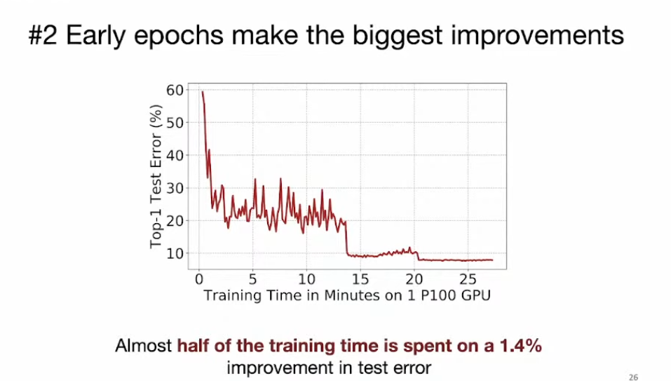

-   Train a smaller proxy model to help with data selection and use final model only to train the full dataset for the final downstream task

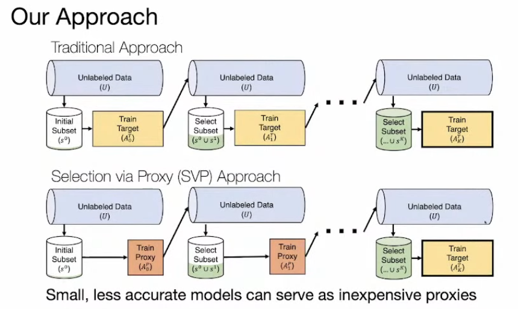

## Core Set Selection

-   When large amounts of labelled data are available, select a small subset of data that accurately approximates the full dataset.
-   Train a proxy model that can be used to identify most useful subset and train full model on this data.

## Active Search

-   https://arxiv.org/abs/2007.00077 #Paper
-   Variation on Active Learning: Goal is to select as many positive examples as possible from billions of unlabeled examples.
-   Pre trained deep learning models tightly cluster unseen concepts forming well connected components
-   Look at local neighborhood of positive examples rather than the entire unlabelled dataset.

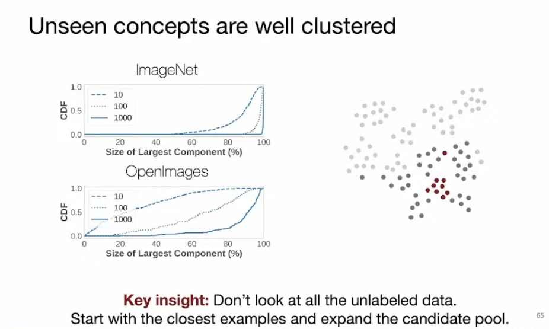

### Similarity Search for Efficient Active Learning and Search (SEALS)

-   Only take examples that lie in the neighborhood of known positive examples

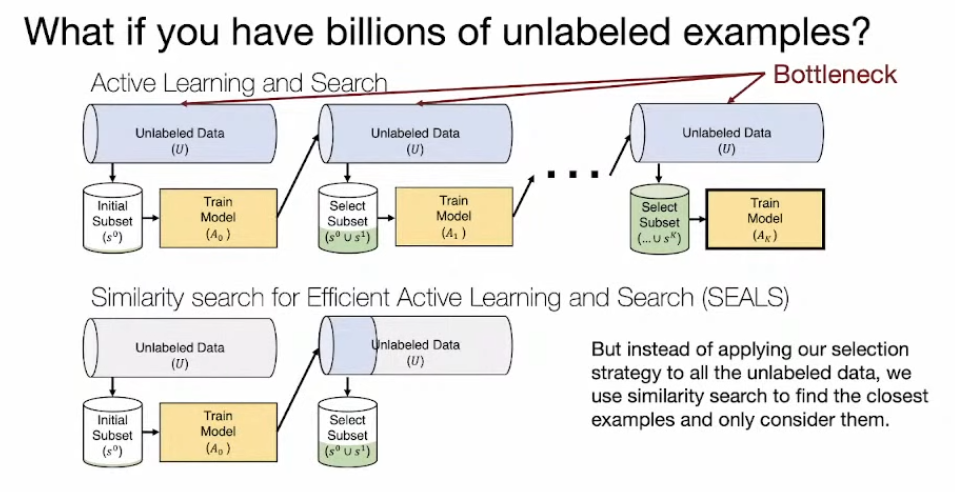

-   In each iteration, take the newly labeled examples and find their neighbors.

### Selection Criteria for Samples

-   Most Likely Positive
-   Max Entropy : Select points with highest entropy based on predicted class probabilities
-   Information density: Select points in regions of high density and high uncertainty
