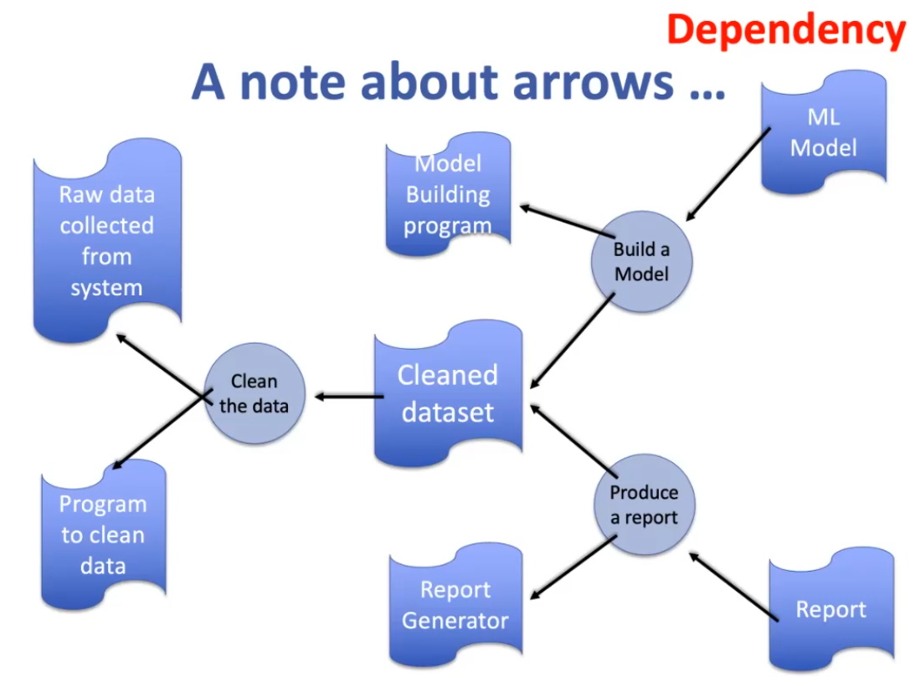
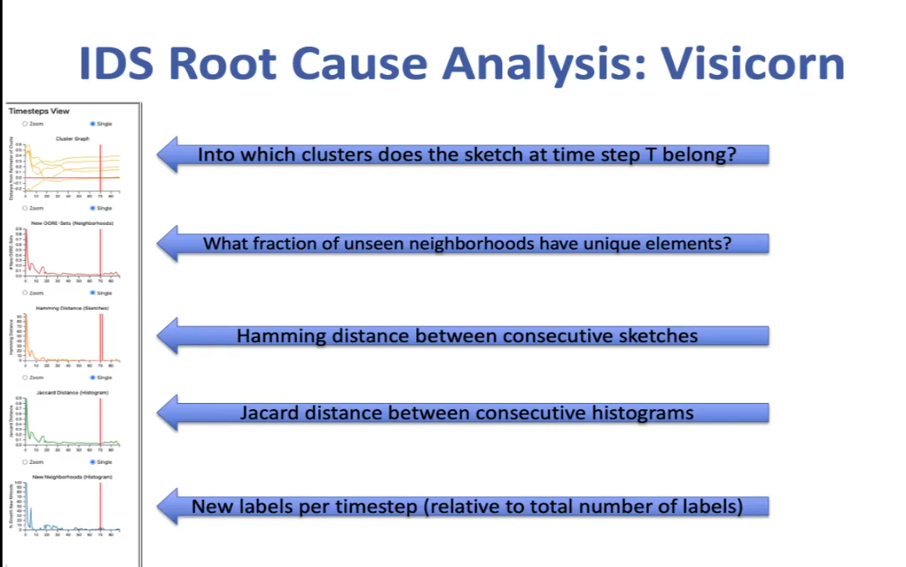
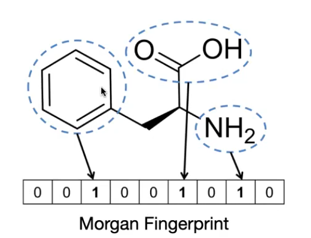
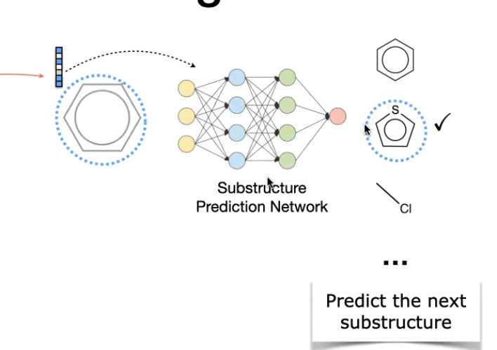
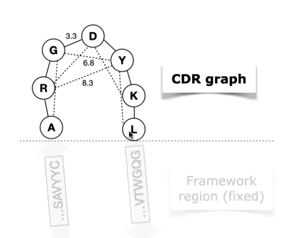

Oracle invite's ML researchers to give biweekly talks. These are my notes from these sessions.

# Provenance and its Applications

Presenter: https://www.seltzer.com/margo/

Provenance == Lineage

How to know whether a painting is authentic: Show chain of ownership of the painting from the beginning.

Provenance: A formal description of how a data element came to be in its current form.

Why and Where Provenance - Why is this piece of data in the Database ? - Where did this come from ? Is it a result of a query ?

Provenance aware storage system: Considers operating system level details

Fundamental Abstraction: Objects connected by activities. Also track who invoked these activites.

Reversing arrows creates a dependency graph.

## Standards

-   Open Provenance Model
-   W3C Prov Model
    -   Stadardization has not been beneficial.
    -   Abstraction is such a high level that it is not possible to build a semantically meaningful application on this prov model.Everybody imposes their own semantic layer on top of this prov model.
-   Open Lineage
-   System provenance standards were also created e.g. CamFlow

## Challenges

-   People don't care about provenance

-   It is like security, people want it but won't pay for it (in \$ or performance/computation).

-   General provenance doesn't help. People want provenance specific to their problem.

-   Provenance is like insurance: you never really want it until it is too late.

-   Takeaway: Focus on provenance applications. E.g. File system search

-   Workflow provenance: ML Model Sharing & Reproducibility.

-   Provenance graphs are DAG.

-   Provenance could be at OS level, database level or application level

-   Tribuo(Java Deep Learning library) has provenance built in.

## Lineage Applications

### Unicorn for Intrusion Detection

Link: https://arxiv.org/pdf/2001.01525.pdf

-   Using provenance graphs for intrusion detection

-   Take snapshots of provenance(streaming graph)
-   Compute a unique label for a node by computing neighborhood of node(3 hop neighborhood). Create a hash value for neighborhood and plot histogram of hash values.
-   Create fixed size sketched for histograms (similarity preserving)
    -   if you measure Jaccard distance between two histograms, it should correspond to hamming distance between sketches.
-   Models are built from sketches. Cluster sketches and keep track of transitions between clusters.
-   Create for every 1000 provenance edges.(some period of time)
-   If sketch does not fall in a cluster, it is a red flag.

### SIGL

Link: https://arxiv.org/abs/2008.11533

-   Uses Graph LSTM for encoder. MLP for decoder.

# Graph Representation Learning for Drug Discovery

Presenter: http://people.csail.mit.edu/wengong/

-   $10^{30}$ possible combinations of molecules exist , but only $10^5$ can be evaluated by pharma companies using existing technology.

-   Molecules are permutation invariant. Labeling nodes of a graph does not make a difference, for a graph neural net to learn this - need to feed all N! combinations in the training data

-   Applications of AI:

    -   Virtual Screening: Predict properties from Molecules
    -   Inverse design: Generate molecules from properties.

## Virtual Screening

### Current Approach

Take a compound → Get Morgan fingerprint (traditional , hand engineered molecular features) → pass through feed forward NN → Get property predictions

**Morgan Fingerprint**

Enumerate all possible substructures and group them using a hash function.

Effectively a bag of sub-structures.

### New Approach

-   Take compound → Learn an embedding using a Graph Neural Networks → Pass through Feed Forward NN → Get prediction
-   For graph:
    -   Node feature: one hot encoding indicating type of atom
    -   Edge feature: single bond, double bond etc.
-   Application:
    -   Used this approach to screen 2335 compounds and measure their growth inhibition against E-coli(bacteria)
    -   Discovered new antibiotic.
    -   Achieved AUC = 0.9
-   Approaches like domain adaptation can improve results.

## Molecular Graph Generation

Graph convolution is not invertible (unlike image convolutions)so generating graphs from embeddings does not work.

### Approach 1

Use NLP like approaches to generate a molecule piece by piece.(e.g. atom by atom)

-   Equivalent to character by character in NLP
-   Simple to implement but higher computational complexity.(Need to re-encode graph after adding every new atom)
-   Have multiple frontier nodes unlike Language E.g. 1 and 2 below

### Approach 2

-   Use molecular substructures rather than atoms.
-   Equivalent to word by word in NLP
-   Performance is better but needs a vocabulary of sub-structures.
    -   Junction tree algorithm can be used to reduce a graph into a tree. tree representations are easier to generate as they do not have cycles
-   Use a NN to predict next substructure to be added.

-   Also need to know how to attach the two sub structures together.
    -   Predict the attaching point in new sub-structure and current partial graph and then merge them.

### Hierarchical Graph Convolution

-   Run graph convolution in the pooled-substructure level graph
-   Propagate atom level embedding upwards

## Antibody Structure Generation

-   More complex 3D molecules.
-   use a 3D generative model to output a 3D point cloud.
-   Application: HIV antibody design
-   Antibodies bind to a virus and trigger body's immune response.
-   Binding specificity/strength is largely determined by complementary determining region.
-   Basic unit of antibody is a residue, whose value can be one of the 20 amino acids.
    -   Each residue is a substrucutre
    -   Each atom has a 3D coordinate.
-   Performance depends on the 3D structure of the amino acids
-   CDR graphs are represented as a K-nearest-neighbor graph

-   Auto regressive models are inadequate as a residue once added will not change . However if a new residue is generated and inserted to the CDR, distance between previous residues should naturally change.

-   Iterative graph refinement is used to update entire graph structure once a new reside is added.

