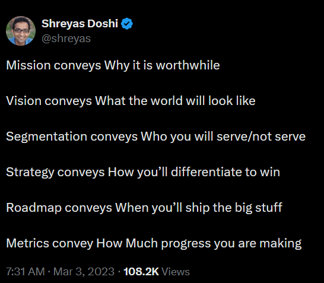

When I stumbled into my first product role, like many others in the same boat, I turned to the product management classics—Marty Cagan’s books, Lenny Rachitsky’s posts, Lean Product Playbook, and the rest. One thing I’ve always found confusing in this literature is the difference between "vision" and "mission." It feels like people go to great lengths to create a distinction that’s not always necessary.

Even a thinker like Shreyas comes up with definitions where I still struggle to understand the clear difference between the two.

From my perspective, if you can clearly articulate the future you’re trying to create, you don’t really need to explain why it’s worthwhile. Your mission is to create that future. To put it simply: what matters most is having an ambitious, long-term goal that can challenge and inspire people. And like any good goal, you should be able to measure whether you’re making progress.

Whether you call this your “mission” or your “vision” doesn’t seem all that important.

Here are a few examples of great mission/vision statements:

-   Microsoft’s original mission to put a computer on every desk and in every home is probably the best example. It was bold and ambitious, and incredibly, they achieved it within 20 to 30 years.

-   SpaceX’s mission is "to make life multiplanetary." Wow. When that’s your mission, it’s no wonder they’ve accomplished so much in the last decade.

-   Meta’s mission is to "give people the power to build community and bring the world closer together." You know you can only fulfill this mission if billions of people are using your platform to make meaningful connections—a goal that’s both ambitious and measurable.

In contrast, I find that many B2B companies have less compelling mission statements.

-   Salesforce: "We bring companies and customers together."
-   Oracle: "We help people see data in new ways, discover insights, and unlock endless possibilities."

If you review the mission statements of companies like IBM and Honeywell, you might feel a little underwhelmed.

Why is that?   I think the challenge for most B2B companies is that after their initial product success, they grow through acquisitions and eventually become a collection of smaller businesses. Their range of products and services becomes so broad that it’s hard to have one concise, coherent mission.

So how do you combat this?   I believe each business unit needs its own mission statement, one that aligns with the company’s overall mission but is specific to what that team is trying to achieve. This is what I’ve aimed to create within the small business unit I’m part of at Oracle.

Finally, nothing illustrates the importance of mission better than the famous anecdote about John F. Kennedy and NASA. During a visit in the 1960s, President Kennedy asked a janitor at the space center what he was doing. The janitor replied, "Mr. President, I’m helping put a man on the moon."

That’s the power of a mission. Failing to tap into that is a missed opportunity for any company.
