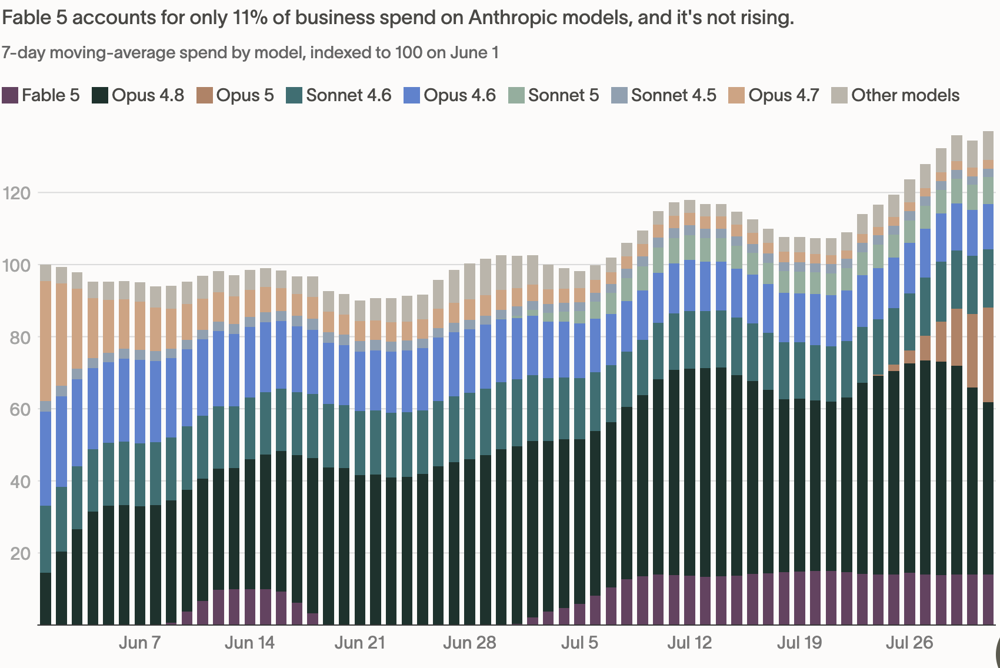

In his interview with Patrick O'Shaughnessy, Anthropic CFO Krishna Rao said the company believes "the returns to frontier intelligence are extremely high." Anthropic's efforts to push frontier capabilities without optimizing for cost efficiency attest to this strategy.

However, the chart below from Ramp suggests a different story. The flat growth rate of Fable indicates that the returns to frontier intelligence are not unbounded as originally imagined.

This is not entirely unexpected. If you spend time on social media, you will have seen people creating workflows where they use Fable as an orchestrator, advisor or reviewer but delegate the actual work to capable, more economical models such as GPT 5.6 or Opus 5. This pattern is probably here to stay.

Further, most projects at traditional enterprises do not require a team of Nobel laureates and Fields medalists. Opus/GPT-5.6/Grok-4.5 level intelligence is sufficient for most white-collar tasks, and returns on higher levels of intelligence may be capped by constraints the institution itself imposes — undocumented processes, limited operational context, and proprietary data that nobody has ever cleaned up.

Anthropic has made it clear that it has no plans to release its next Mythos class model — Model 2. So how will it earn a return on these extremely expensive training runs?

Well, maybe the end game is not selling more tokens to the enterprise.

In an interview with Dwarkesh, Dario Amodei said:

> "Not every token that's output by the model is worth the same amount. Think about what is the value of the tokens that the model outputs when someone calls them up and says, 'My Mac isn't working,' or something, the model's like, 'restart it.' Someone hasn't heard that before, but the model said that 10 million times. Maybe that's worth like a dollar or a few cents or something. Whereas if the model goes to one of the pharmaceutical companies and it says, **'*Oh, you know, this molecule you're developing, you should take the aromatic ring from that end of the molecule and put it on that end of the molecule. If you do that, wonderful things will happen. Those tokens could be worth tens of millions of dollars.***"

I think the italicised bit is where Anthropic believes the real profits are to be earned — not by selling tokens, but by having a stake in the outcomes those tokens create.

Eli Lilly booked \$36.5 billion in revenue in 2025 from tirzepatide, sold as Mounjaro and Zepbound, at the \~89% gross margins typical of pharma. Now imagine if Anthropic's AI had a critical role in designing this molecule and was entitled to even a 10% share of that revenue. That is \$3.65 billion a year from a single compound — roughly a third of everything Anthropic earned in 2025. As AI gets even better, the role it plays in these discoveries can only become more important.

Similarly, Jane Street reportedly booked \$39.6 billion in net trading revenue in 2025, trading its own capital rather than clients' money. What if Anthropic stands up its own trading desk? Jane Street hires some of the smartest minds in the world, but would you bet against recursively improving superintelligence?

Dario has said that it is hard for him to see that there won't be trillions of dollars in revenue before 2030. You don't get there by selling \$20 or \$200 subscriptions to vibe coders, or even multimillion-dollar enterprise contracts, but by growing and then taking a big bite out of the revenue of entire industries.

## References

- Jane Street 2025 results — Yahoo Finance: <https://finance.yahoo.com/markets/stocks/articles/jane-street-pays-9-38-162520429.html>
- FY2025 pharma sales, tirzepatide and semaglutide — Drug Discovery & Development: <https://www.drugdiscoverytrends.com/pharma-50-keytruda-holds-the-top-brand-slot-but-tirzepatide-and-semaglutide-have-already-passed-it-at-the-molecule-level-in-fy2025/>
- <https://x.com/JayaGup10/article/2089924561441841152>