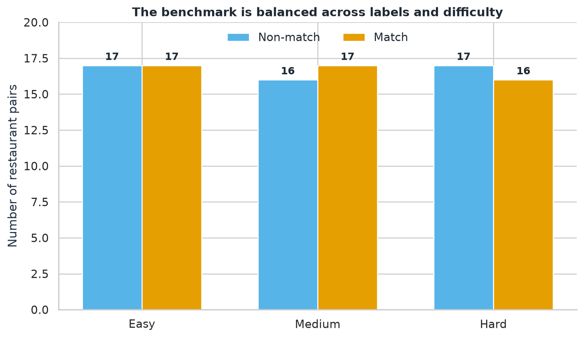
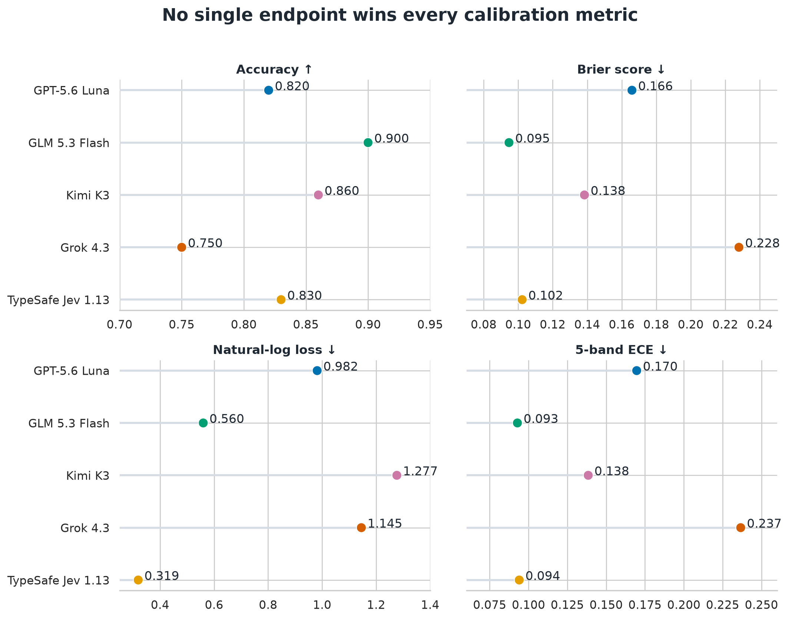
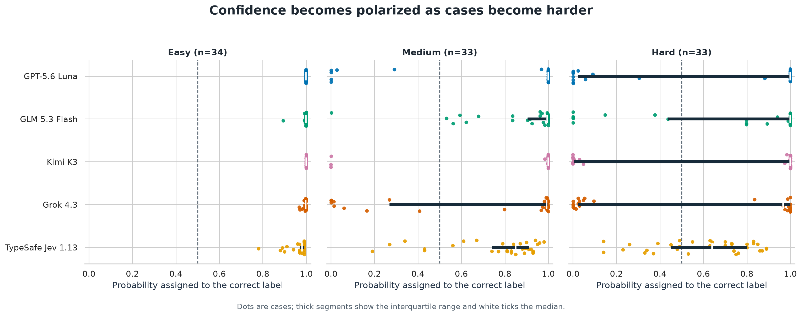
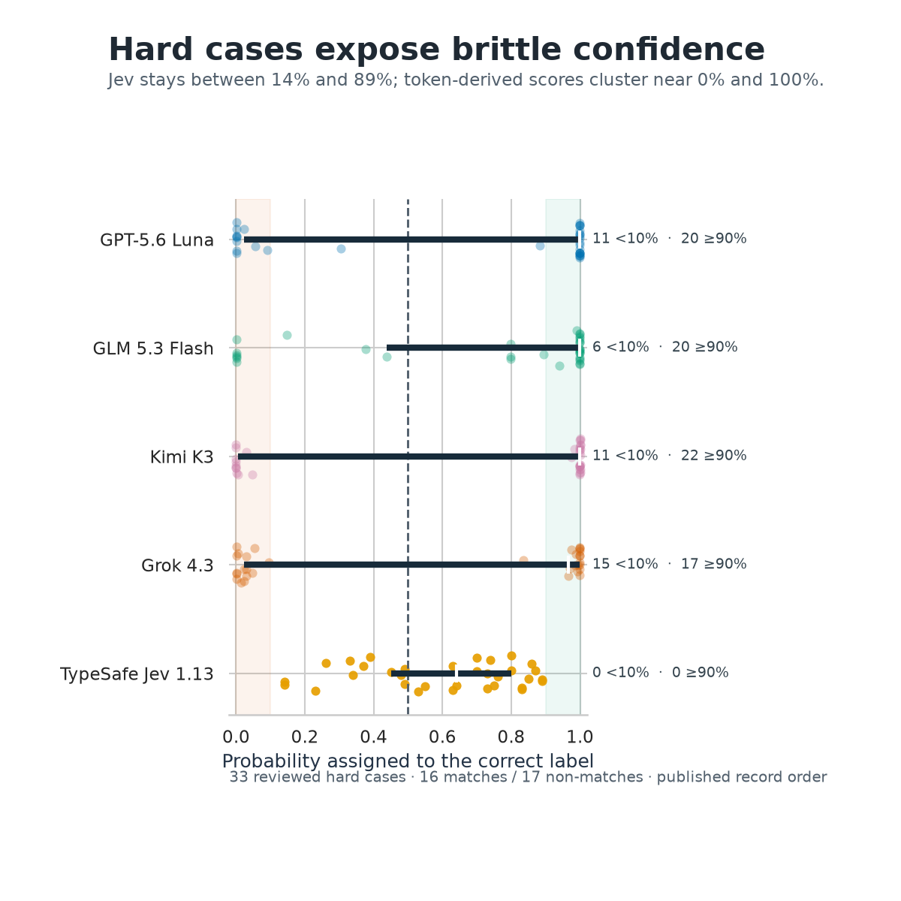
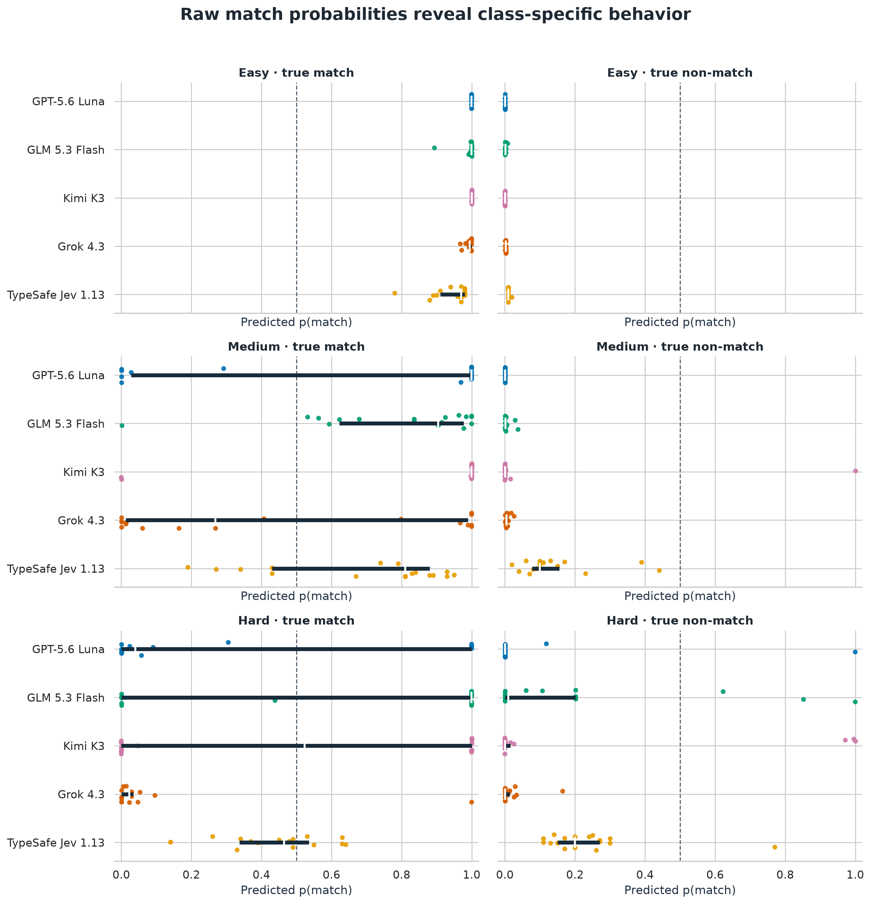
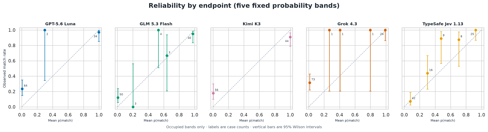

```{python}
from pathlib import Path
import sys

REPORT_DIR = Path.cwd()
if not (REPORT_DIR / "data" / "predictions.csv").exists():
    REPORT_DIR = REPORT_DIR / "blog" / "2026-09-19-llm-calibration"
sys.path.insert(0, str(REPORT_DIR.resolve()))

from report_analysis import (
    dataset_breakdown,
    difficulty_confidence_sd_table,
    difficulty_metric_table,
    generate_all_figures,
    hard_confidence_bands,
    load_predictions,
    metric_table,
)

DATA = load_predictions(REPORT_DIR / "data" / "predictions.csv")
IMAGES = REPORT_DIR / "images"
_ = generate_all_figures(DATA, IMAGES)
METRIC_FORMAT = {
    "Accuracy": "{:.3f}",
    "Brier": "{:.3f}",
    "Log loss": "{:.3f}",
    "ECE": "{:.3f}",
}
```

::: {.callout-note appearance="simple" icon="false"}
## Disclosure

OpenAI Codex was used to carry out the analysis and generate this report. I reviewed the analysis, interpretation, and final text before publication.
:::

## Benchmark design

The task is deterministic binary entity resolution: do two records describe the same physical restaurant outlet? The reviewed benchmark contains 100 pairs, balanced 50/50 between matches and non-matches. Each pair is also assigned a reviewed difficulty level.

```{python}
counts = dataset_breakdown(DATA)
counts.loc["Total"] = counts.sum()
counts
```

{fig-alt="Grouped bars show 17 matches and 17 non-matches for easy cases, 17 matches and 16 non-matches for medium cases, and 16 matches and 17 non-matches for hard cases."}

The constructed 50/50 prevalence makes model comparisons straightforward, but it is not an estimate of how often records match in production.

## Study assumptions

These choices materially affect how the comparison should be interpreted:

- **Probability interface:** Jev returns a native binary probability. Luna, GLM, Kimi, and Grok are evaluated through answer-token log probabilities.
- **Single-label fallback:** When Luna, GLM, or Grok returned only one of the two requested answer labels, the predeclared rule assigned `0.999` to the returned label and `0.001` to the missing alternative. Kimi's extreme probabilities came from returned log probabilities, not this fallback.
- **Reasoning setting:** Luna and Grok used `none`; GLM and Kimi used `low` because those routes generated or required reasoning before the visible answer.
- **Comparison unit:** The results compare the exact endpoint configurations and probability interfaces used here—not abstract model families under identical settings.

## The finding in one sentence

TypeSafe Jev produced the least brittle confidence on difficult cases and the best overall log loss, while GLM 5.3 Flash still led overall accuracy, Brier score, and expected calibration error.

The key takeaway is that a model can make more correct decisions while assigning damaging levels of confidence to the mistakes it does make. Conversely, a cautious model can limit the cost of its errors without winning every aggregate metric.

Does Jev 1.13 represent a new class of models that can curb the tendency of LLMs to be overconfident? This limited experiment suggests that possibility, but broader replication is needed.

## Overall results

Accuracy measures decisions. Brier score and natural-log loss measure probabilistic quality. ECE summarizes the gap between predicted probabilities and observed frequencies using five fixed probability bands; identical probabilities always remain together. Higher accuracy is better; lower Brier, log loss, and ECE are better.

```{python}
overall = metric_table(DATA)
overall.style.format(METRIC_FORMAT).hide(axis="index")
```

{fig-alt="Four dot plots compare accuracy, Brier score, log loss, and ECE for Luna, GLM, Kimi, Grok, and Jev. Jev has the lowest log loss while GLM leads the other three metrics."}

Jev's `0.319` log loss is substantially lower than GLM's `0.560`, but GLM has higher accuracy (`0.900` versus `0.830`), a lower Brier score (`0.095` versus `0.102`), and slightly lower ECE (`0.093` versus `0.094`). There is no metric-independent winner.

## Confidence changes with difficulty

For the next view, each probability is converted to the probability assigned to the correct label: `p(match)` for a true match and `1 − p(match)` for a true non-match. This makes confident correct and confident incorrect predictions visible on a shared axis.

{fig-alt="Three strip plots show correct-label probability for each model on easy, medium, and hard cases. Token-derived probabilities become polarized near zero and one on harder cases, while Jev remains more spread through the middle."}

All five endpoints are effectively certain and correct on the easy stratum. The separation begins on medium cases and becomes stark on hard cases. Kimi, Luna, and Grok are especially polarized: their medians can remain high even while a sizable minority of cases receive almost zero probability on the correct answer. Note that the median for Jev decreases as the difficulty level increases.

## Hard cases expose brittle confidence

The hard stratum contains 33 pairs: 16 matches and 17 non-matches.

{fig-alt="A square strip plot compares probability assigned to the correct label on 33 hard cases. Jev values range from 14 to 89 percent, while the token-derived endpoints contain many values below 10 percent and at or above 90 percent."}

```{python}
hard_confidence_bands(DATA).style.hide(axis="index")
```

Jev assigns the correct label between 14% and 89% probability on every hard case. It has no predictions below 10% or at least 90%. By contrast, Kimi has 22 hard cases at or above 90% and 11 below 10%; Grok has 17 and 15 respectively. This endpoint mass explains why a few confidently wrong predictions can dominate natural-log loss.

The difficulty-level metrics show the trade-off directly:

```{python}
difficulty_scores = difficulty_metric_table(DATA)
difficulty_scores.style.format(METRIC_FORMAT).hide(axis="index")
```

On hard cases, Jev improves on GLM's Brier score (`0.210` versus `0.229`) and log loss (`0.610` versus `1.395`) and has lower five-band ECE (`0.155` versus `0.256`). GLM remains more accurate (`72.7%` versus `63.6%`), so Jev's stronger probabilistic scores do not translate into better hard-case classification accuracy.

## Raw match probabilities and class behavior

Correct-label probability is communicatively useful, but it can hide class-specific tendencies. The raw `p(match)` distributions below separate true matches from true non-matches.

{fig-alt="Six panels split predicted match probabilities by difficulty and true label. Luna and Grok show a strong non-match tendency on difficult true matches, while Jev uses a narrower range for both classes."}

For a true match, values should be high; for a true non-match, values should be low. Luna and Grok's hard-case failures are concentrated among true matches, revealing a strong tendency toward the non-match answer rather than symmetric uncertainty.

## Reliability

Reliability plots compare mean predicted match probability with the observed match rate. Perfect calibration follows the diagonal. The plot below uses five fixed probability bands, keeps ties together, omits empty bands, does not connect the markers, and shows both case counts and 95% binomial intervals. These intervals describe uncertainty within the reviewed benchmark under a binomial model; they are not guarantees about calibration in a different production population.

{fig-alt="Five small reliability diagrams compare predicted match probabilities with observed match rates using occupied fixed-width bands. Markers are not connected, marker labels give bin counts, and vertical bars show 95 percent Wilson intervals."}

Visually Jev 1.13 appears most well calibrated of the available models.

## Scope of the conclusion

This is a fixed, reviewed suite of 100 restaurant pairs with balanced prevalence. The results describe these endpoint configurations on this benchmark. They should motivate broader replication, not a universal claim about production entity resolution.

## Reproduction

The post source and accompanying Python analysis module recompute every table and figure from the anonymous prediction-level CSV included with this post. The public data contains sequential case numbers, labels, difficulty, record order, model name, probabilities, correctness, and extraction method. It excludes restaurant records, pair identifiers, source provenance, provider responses, local paths, and evidence hashes.

The complete benchmark implementation, analysis workflow, and reproducibility materials are available in the [evaluating-calibration-llm repository](https://github.com/govindgnair23/evaluating-calibration-llm).
